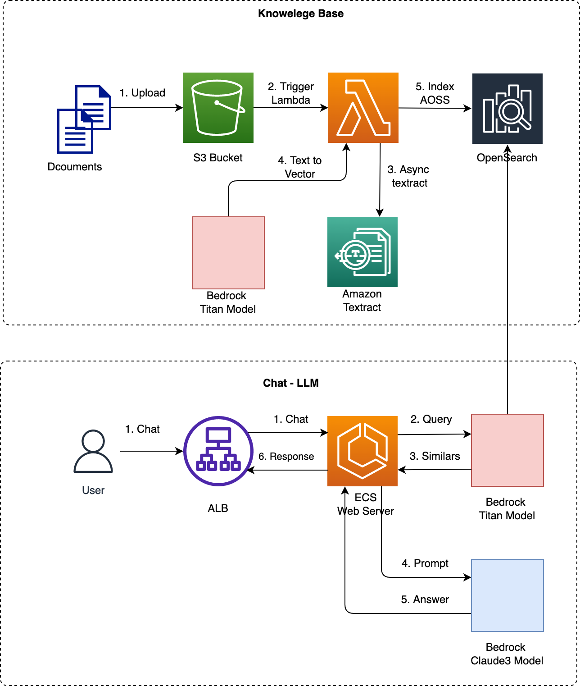

## Architecture



[video demo](https://d2cvlmmg8c0xrp.cloudfront.net/demo/next-bedrock-demo.mp4)

[link demo](https://bedrock.entest.io/)

[](https://d2cvlmmg8c0xrp.cloudfront.net/demo/next-bedrock-demo.mp4)

> [!WARNING]  
> You have to update some parameters by yourself before get it running. For example, setup data access policy for OpenSearch Serverless (AOSS) so Lambda, ESC Execution Role can query and index AOSS, etc.

## OpenSearch

- Create a OpenSearch serverless collection (AOSS)
- Setup data access policy

Here is CDK stack for opensearch

```ts
import { Stack, StackProps, aws_opensearchserverless } from "aws-cdk-lib";
import { Construct } from "constructs";
import * as fs from "fs";
import * as path from "path";

const strAccessPolicy = JSON.stringify(
  JSON.parse(
    fs.readFileSync(
      path.join(__dirname, "./../policy/access-policy.json"),
      "utf-8"
    )
  )
);

const strNetworkPolicy = JSON.stringify(
  JSON.parse(
    fs.readFileSync(
      path.join(__dirname, "./../policy/network-policy.json"),
      "utf-8"
    )
  )
);

const strEncryptPolicy = JSON.stringify(
  JSON.parse(
    fs.readFileSync(
      path.join(__dirname, "./../policy/encryption-policy.json"),
      "utf-8"
    )
  )
);

interface AOSSProps extends StackProps {
  arnPrincipal: string;
}

export class AOSSStack extends Stack {
  constructor(scope: Construct, id: string, props: AOSSProps) {
    super(scope, id, props);

    const collection = new aws_opensearchserverless.CfnCollection(
      this,
      "demo",
      {
        name: "demo",
        description: "vector search demo",
        type: "VECTORSEARCH",
        standbyReplicas: "DISABLED",
      }
    );

    const accessPolicy = new aws_opensearchserverless.CfnAccessPolicy(
      this,
      "accessPolicyDemo",
      {
        name: "demo-access-policy",
        type: "data",
        description: "access policy demo",
        policy: strAccessPolicy,
      }
    );

    const networkPolicy = new aws_opensearchserverless.CfnSecurityPolicy(
      this,
      "networkPolicyDemo",
      {
        name: "network-policy-demo",
        type: "network",
        description: "network policy demo",
        policy: strNetworkPolicy,
      }
    );

    const encryptionPolicy = new aws_opensearchserverless.CfnSecurityPolicy(
      this,
      "encryptionPolicyDemo",
      {
        name: "encryption-policy-demo",
        type: "encryption",
        description: "encryption policy demo",
        policy: strEncryptPolicy,
      }
    );

    collection.addDependency(networkPolicy);
    collection.addDependency(encryptionPolicy);
    collection.addDependency(accessPolicy);
  }
}
```

To allow the Lambda function can query and index AOSS we need to setup the data access policy at AOSS side

```json
[
  {
    "Description": "Rule 1",
    "Rules": [
      {
        "ResourceType": "collection",
        "Resource": ["collection/demo"],
        "Permission": [
          "aoss:CreateCollectionItems",
          "aoss:DeleteCollectionItems",
          "aoss:UpdateCollectionItems",
          "aoss:DescribeCollectionItems"
        ]
      },
      {
        "ResourceType": "index",
        "Resource": ["index/demo/*"],
        "Permission": [
          "aoss:CreateIndex",
          "aoss:DeleteIndex",
          "aoss:UpdateIndex",
          "aoss:DescribeIndex",
          "aoss:ReadDocument",
          "aoss:WriteDocument"
        ]
      }
    ],
    "Principal": ["arn:aws:iam::$ACCOUNT:user/RoleForLambdaIndexAossBedrock"]
  }
]
```

## Lambda

- Read PDF from S3
- Load PDF files and split into chunk
- Convert chunk into embedding vectors
- Index into AOSS

Here is CDK stack to deploy the lambda function (Docker image)

```ts
export class LambdaAossStack extends Stack {
  constructor(scope: Construct, id: string, props: LambdaAossProps) {
    super(scope, id, props);

    // role for lambda to read opensearch
    const role = new aws_iam.Role(this, "RoleForLambdaIndexAossBedrock", {
      roleName: "RoleForLambdaIndexAossBedrock",
      assumedBy: new aws_iam.ServicePrincipal("lambda.amazonaws.com"),
    });

    role.addToPolicy(
      new aws_iam.PolicyStatement({
        effect: Effect.ALLOW,
        resources: [`arn:aws:s3:::${props.bucketName}/*`],
        actions: ["s3:GetObject"],
      })
    );

    role.addToPolicy(
      new aws_iam.PolicyStatement({
        effect: Effect.ALLOW,
        resources: [
          `arn:aws:bedrock:${this.region}::foundation-model/anthropic.claude-v2`,
          `arn:aws:bedrock:${this.region}::foundation-model/stability.stable-diffusion-xl-v1`,
          `arn:aws:bedrock:${this.region}::foundation-model/amazon.titan-embed-text-v1`,
        ],
        actions: [
          "bedrock:InvokeModel",
          "bedrock:InvokeModelWithResponseStream",
        ],
      })
    );

    role.addToPolicy(
      new aws_iam.PolicyStatement({
        effect: Effect.ALLOW,
        resources: [props.aossCollectionArn],
        actions: ["aoss:APIAccessAll"],
      })
    );

    // lambda function to query opensearch
    new aws_lambda.Function(this, "LamdaQueryOpenSearch", {
      functionName: "LambdaIndexAossBedrock",
      memorySize: 2048,
      timeout: Duration.seconds(300),
      code: aws_lambda.EcrImageCode.fromAssetImage(
        path.join(__dirname, "./../lambda/lambda-index-aoss/")
      ),
      handler: aws_lambda.Handler.FROM_IMAGE,
      runtime: aws_lambda.Runtime.FROM_IMAGE,
      environment: {
        OPENSEARCH_DOMAIN: props.opensearchDomain,
        PYTHONPATH: "/var/task/package",
        REGION: this.region,
        BUCKET: props.bucketName,
      },
      role: role,
    });
  }
}
```

Dockerfile

```py
FROM public.ecr.aws/lambda/python:3.9

# create code dir inside container
RUN mkdir ${LAMBDA_TASK_ROOT}/source

# copy code to container
COPY "requirements.txt" ${LAMBDA_TASK_ROOT}/source

# copy handler function to container
COPY ./index.py ${LAMBDA_TASK_ROOT}

# install dependencies for running time environment
RUN pip3 install -r ./source/requirements.txt --target "${LAMBDA_TASK_ROOT}"
RUN python3 -m pip install boto3 --upgrade

# set the CMD to your handler
CMD [ "index.handler" ]
```

## Web Server

- Convert user question to embedding vectors
- Query AOSS to get context
- Build prompt from the user question and context
- Prompt Bedrock Claude models

Basically, the webserver will invoke Bedrock models in streaming mode, then stream response to client chunk by chunk

- Create Bedrock client
- Build prompt
- Prompt Bedrock FM in streaming mode
- Stream response to client

Here is an example

```ts
import {
  BedrockRuntime,
  InvokeModelWithResponseStreamCommand,
} from "@aws-sdk/client-bedrock-runtime";
import { NextRequest } from "next/server";

const decoder = new TextDecoder();

const bedrock = new BedrockRuntime({ region: "us-east-1" });

async function* makeIterator(prompt: String) {
  const claudePrompt = `\n\nHuman: ${prompt} \n\nAssistant:`;

  const config = {
    prompt: claudePrompt,
    max_tokens_to_sample: 2048,
    temperature: 0.5,
    top_k: 250,
    top_p: 1,
    stop_sequences: ["\n\nHuman:"],
  };

  const command = new InvokeModelWithResponseStreamCommand({
    modelId: "anthropic.claude-3-haiku-20240307-v1:0",
    contentType: "application/json",
    accept: "application/json",
    body: JSON.stringify({
      anthropic_version: "bedrock-2023-05-31",
      max_tokens: 2048,
      messages: [
        {
          role: "user",
          content: [
            {
              type: "text",
              text: prompt,
            },
          ],
        },
      ],
    }),
  });

  try {
    console.log("call bedrock ...");
    const response = await bedrock.send(command);
    if (response.body) {
      console.log(response.body);
      for await (const chunk of response.body) {
        if (chunk.chunk) {
          try {
            const json = JSON.parse(decoder.decode(chunk.chunk.bytes));
            console.log(json);
            if (json.type == "content_block_delta") {
              yield json.delta.text;
              // yield chunk.chunk.bytes;
            }
          } catch (error) {
            console.log(error);
            yield " ";
          }
        }

        // await sleep(100);
      }
    }
  } catch (error) {
    console.log(error);
  }
}

function iteratorToStream(iterator: any) {
  return new ReadableStream({
    async pull(controller) {
      const { value, done } = await iterator.next();

      if (done) {
        controller.close();
      } else {
        controller.enqueue(value);
      }
    },
  });
}

function sleep(time: number) {
  return new Promise((resolve) => {
    setTimeout(resolve, time);
  });
}

const encoder = new TextEncoder();

export async function GET() {
  const iterator = makeIterator("how to cook chicken soup?");
  const stream = iteratorToStream(iterator);

  return new Response(stream);
}

export async function POST(request: NextRequest) {
  const res = await request.json();
  console.log(res);
  const iterator = makeIterator(res.prompt);
  const stream = iteratorToStream(iterator);
  return new Response(stream);

  // return Response.json({ name: "hai" });
}
```

## Reference

- [NodeJs Back Pressure](https://nodejs.org/en/learn/modules/backpressuring-in-streams)

- [Vercel Stream Response](https://vercel.com/docs/functions/streaming/quickstart)
